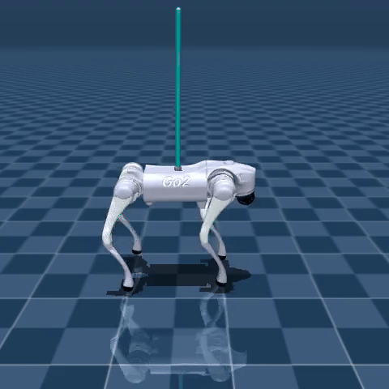

## Inverted Pendulum balancing on Quadruped using off-policy RL
This repository consists of a gymnasium environment which implements a reinforcement learning environment to facilitate training controllers for balancing inverted pendulum on a quadruped.

Currently, only Unitree's **Go2** with **TD3 (Twin Delayed DDPG)** algorithm is supported out-of-the-box. The codebase follows modular structure and it is easy to add other models and algorithms.

This repository uses ``stable_baselines3`` with changes made to make it work along with ``gymnasium v1.0.0`` (refer [here](https://github.com/DLR-RM/stable-baselines3/pull/1837) for changes). 
You may use my [fork](https://github.com/pulak-gautam/stable-baselines3) in the meanwhile.

<p style="text-align: center;">
    
</p>

## Getting Started
### Installation
```
## install pre-requisites, it would be much easier to install it under seperate virtual environment to avoid clashing gymnasium versions
# to create a new virtualenv: python -m venv venv && source venv/bin/activate
pip install -r requirements.txt
git clone https://github.com/pulak-gautam/quadruped-pend-gym && cd quadruped-pend-gym
pip install -e .
```
### Running 
```
# run example standup script
python3 tests/test_quad_standup.py

# run td3 based training script for balancing inverted pend
python3 quadruped_pend_gym/quad_pend_rl/scripts/train.py
```
 
